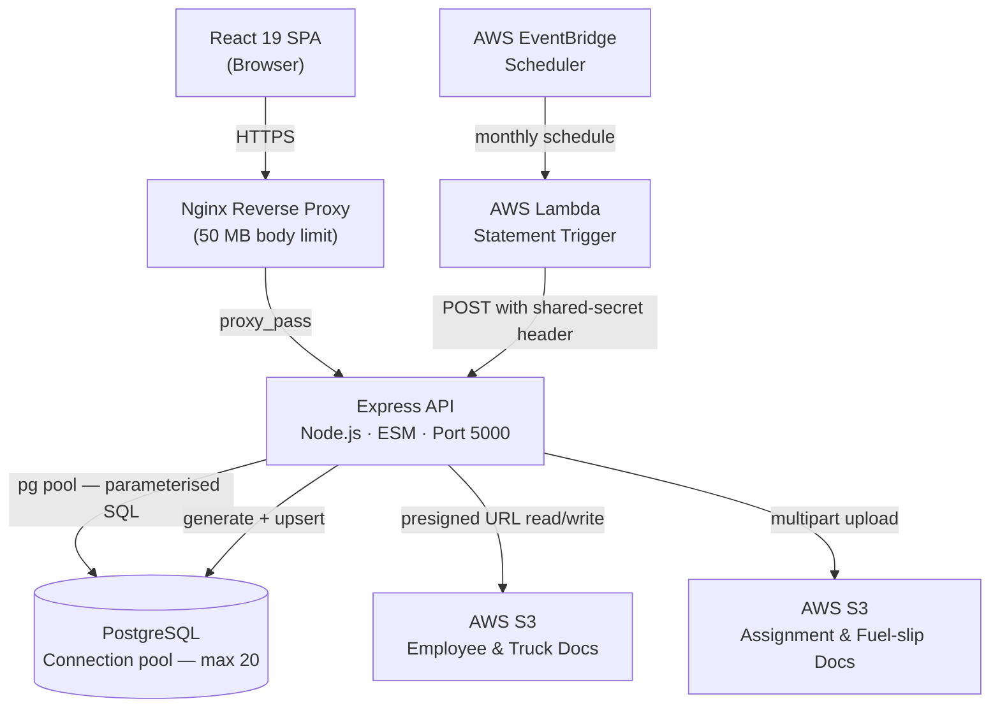

# logistics-platform-casestudy
A case study from a production system I built and operate. Code is not included due to client confidentiality — this documents the architecture and the engineering decisions behind it

# Trucking Logistics Management Platform

## 1. System Overview

A full-stack operations and financial management platform for a logistics client, covering the complete job lifecycle from instruction creation through invoicing, payment allocation, and monthly financial reporting. The system serves several distinct actor roles — controllers, finance clerks, directors, and subcontractors — over a shared PostgreSQL database, with compliance documents held in S3 and monthly statement generation driven on a fixed schedule by AWS EventBridge.

The interesting parts of this system are not the CRUD screens. They are the financial calculations that have to be reproducible after the fact: revenue attributed correctly across multi-leg jobs, payroll that resolves against historical rates, and client statements that are true point-in-time snapshots rather than accumulated ledgers. Most of the design decisions below exist to make those calculations correct and auditable.

---

## 2. Architecture Diagram

---

## 3. Tech Stack

| Layer | Technology | Rationale |
|---|---|---|
| Frontend framework | React 19 | Concurrent rendering features; stable ecosystem for a data-heavy internal tool |
| Routing | React Router v7 | Nested route layout that matches the role-scoped page hierarchy |
| Styling | Tailwind CSS v4 | Utility-first; avoids a growing custom CSS surface and keeps styles co-located |
| Animation | Framer Motion | Declarative transitions for modals and page entries |
| Charts | Recharts + Chart.js | Recharts for composable data viz; Chart.js for chart types Recharts doesn't cover |
| PDF generation | jsPDF + autotable + html2pdf | Client-side rendering of tax invoices and wage slips without a server-side PDF service |
| Excel export | ExcelJS | Structured spreadsheet export for financial reports |
| HTTP client | Axios | Interceptors attach the auth token globally |
| Backend framework | Express.js | Minimal and well-understood; a structured REST API doesn't need GraphQL |
| Authentication | Passport.js (LocalStrategy) + JWT | Passport handles interactive login; JWT handles stateless API calls from the SPA |
| Password hashing | bcrypt | Industry-standard adaptive hashing |
| Database | PostgreSQL | Strong JSONB, array, and window-function support for the analytics queries |
| Database access | node-postgres, raw SQL | Complex CTEs and lateral joins are easier to reason about in SQL than in a query builder |
| File storage | AWS S3 | Durable object storage for compliance documents; presigned URLs keep credentials server-side |
| Upload middleware | multer / multer-s3 | Streams multipart uploads straight to S3 without buffering to disk |
| Scheduled jobs | AWS Lambda + EventBridge | Decouples the monthly run from the application process so a restart or deploy can't miss it |
| Reverse proxy | Nginx | TLS termination and the raised body limit needed for document uploads |
| Module system | ESM | Consistent module syntax across client and server |

---

## 4. Key Technical Decisions

**Raw SQL throughout, no ORM.** The analytics layer needs multi-CTE queries that attribute job revenue across legs proportionally, lateral joins to explode embedded JSON arrays, and window functions to resolve container rates. These are natural to express in SQL and tend to become unwieldy in an ORM — at which point you reach for the raw-query escape hatch anyway and lose most of the benefit. So the project skips the abstraction entirely and writes the queries directly. The honest cost of this choice is real: there is no automated migration framework and no compile-time type safety on query results. Those are deliberate trade-offs made with eyes open, not oversights, and I revisit them in the final section.

**Embedded JSON for payment line items instead of a normalised child table.** A payment in this domain frequently allocates a single sum across several invoice dates in one transaction. That maps cleanly onto one payment row with an embedded array of applications: the array is the natural write unit, and reading a payment in full needs no join. The trade-off surfaces on the analytics side, where aggregating across large payment volumes requires lateral joins that are more expensive than indexed foreign-key lookups, and where individual line items cannot be independently indexed or constrained by the database. For the write and single-read patterns that dominate here, that was the right side of the trade; for a reporting-heavy workload it would not be.

**Statement aging recomputed live, not carried forward.** Each monthly client statement is built by querying the outstanding instructions and ad-hoc charges as they stand at generation time and aging each item against the generation date — rather than taking last month's closing balance and adjusting it. Carry-forward is cheaper, but it compounds any data error month over month and makes backdated corrections genuinely hard to reconcile. Recomputing from live outstanding items means every statement is a true point-in-time snapshot of what is actually owed. The price is that generation is more expensive, and that an incorrectly set payment status propagates into every statement until it's fixed — but a wrong number that's traceable to current data beats a wrong number inherited from an opaque running total.

**Statement generation triggered externally, not by in-process cron.** The monthly run is fired by a scheduled Lambda that calls an authenticated endpoint, rather than by a cron task living inside the API process. An in-process scheduler would silently miss its window if the server happened to be restarting or mid-deploy on the first of the month — exactly the kind of failure nobody notices until finance asks where the statements are. Moving the trigger outside the application makes the run independent of application uptime. The endpoint authenticates the call with a shared secret checked ahead of the normal user-token path, so no user session is involved. The cost is an additional external resource to operate, and a symmetric shared secret whose leakage would let an attacker trigger statement regeneration at will.

**Driver rates versioned with effective-date ranges.** Transport rates change periodically, but historical invoices must remain reproducible at whatever rate was in force when the leg actually ran. Rather than keep only the current rate (and silently corrupt past calculations on every change) or reach for full event sourcing, the rate table gained an effective-from and an optional effective-to column, with all pre-existing rates backdated to the start of recorded history so nothing breaks. A composite index keeps the date-range lookup efficient, and rate resolution selects the most recent rate effective on or before the relevant date. The sharp edge — and it is a real one — is that nothing in the database stops two overlapping ranges from existing for the same route; non-overlap is an application-level invariant, which is a load-bearing assumption I'd rather have enforced closer to the data.

**JWT signing secret generated at process startup.** The token-signing secret is generated fresh from cryptographically random bytes each time the server boots, rather than read from a persistent configuration value. The upside is that no real secret ever has to live in committed configuration. The downside is structural and unavoidable given the approach: every restart issues a new signing secret, so every previously issued token is invalidated the moment the process cycles — meaning every deploy or crash logs all active users out. This is the weakest decision in the system. It was a reasonable shortcut early in development and is now a known limitation with a small, well-understood fix; I discuss it in the final section.

---

## 5. System Design Highlights

**Proportional revenue attribution across multi-leg jobs.** Per-truck and per-subcontractor turnover is computed by splitting each instruction's total cost across the legs it spans and the trucks that ran each leg. Counting distinct legs per instruction and distinct trucks per leg, then dividing the total accordingly, distributes revenue without double-counting when several trucks share one leg or when one instruction spans several legs. It resolves in a single pass over the leg-to-instruction join rather than in application code stitching together multiple round trips.

**Point-in-time payroll against temporal history.** Wage calculations resolve an employee's base salary and deductions from history tables as of the last day of the target month, selecting the most recent values effective on or before that cutoff. A wage slip generated for a past month therefore stays correct after a pay change, because it computes against the rates that were in force at the time rather than today's values. The same temporal-lookup shape recurs across the financial calculations and is, in effect, the spine of the whole system.

**Invoice date anchored to service delivery, not record creation.** When an invoice is generated, its date is set to the earliest date on which the first leg of the job actually ran — not the timestamp the invoice was created. This anchors the document to when the service was delivered, which is what matters for tax-period reporting and aging analysis. It's a small detail that prevents a whole category of period-boundary disputes.

**Two user tables behind one login flow.** Authentication checks an owner/staff table and an employee table in turn, tagging the resulting session with which table the account came from; the session-restore path branches on that tag. This lets two account types with genuinely different schemas share a single login flow, while preserving the freedom to keep them separate or merge them later without touching the auth middleware. It's a pragmatic accommodation of two pre-existing data shapes rather than a forced unification.

---

## 6. What I Would Do Differently

**Persist the JWT signing secret.** Generating the secret fresh on every boot is the system's worst decision, and the reasoning behind it — keeping a real secret out of committed config — is better served by reading the secret from a managed, persistent source. As it stands, every deploy or crash silently invalidates all sessions and forces a re-login, which is an operational paper cut that compounds. The fix is genuinely small; the reason it survived is that nothing about it shows up in normal testing — sessions only break across a restart, and in development you restart so often you stop noticing. That's exactly the class of bug that hides until production. I'd treat token-signing material as persistent infrastructure config from the start.

**Adopt a real migration framework.** Committing to raw SQL was the right call for the query layer, but I let that decision bleed into schema management, where it doesn't belong. Hand-applied SQL files with no ordering guarantees, no applied-state tracking, and no down-paths are fine with one developer and one database, and they get dangerous the moment there's a second environment or a second person. The query layer and the schema-change workflow are separable concerns, and I conflated them. A lightweight migration runner would have cost almost nothing up front and removed a standing source of drift between environments.

**Enforce rate-range integrity in the database.** The effective-date versioning is sound, but its central invariant — no two overlapping rate periods for the same route — lives entirely in application code. That means correctness depends on every write path being disciplined forever, and a single careless insert can produce a silently ambiguous rate lookup that surfaces later as a quietly wrong invoice. This is the kind of rule a database is built to guarantee, via an exclusion constraint over the route and date range, and pushing it down to the schema would turn a possible silent data-integrity bug into an impossible one. Trusting the application to hold an invariant the database could enforce was the wrong default.
